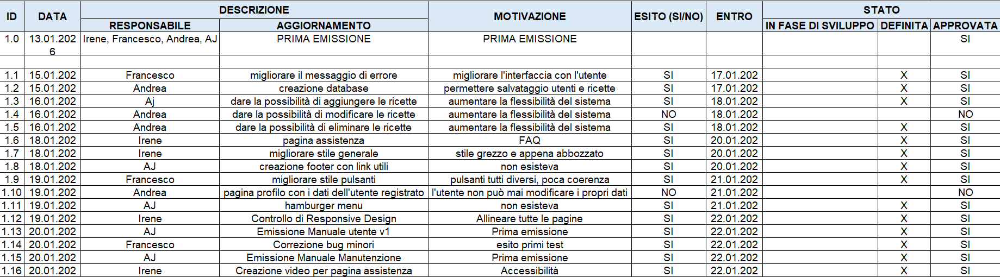
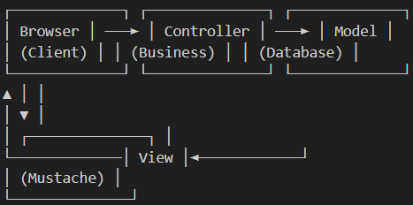
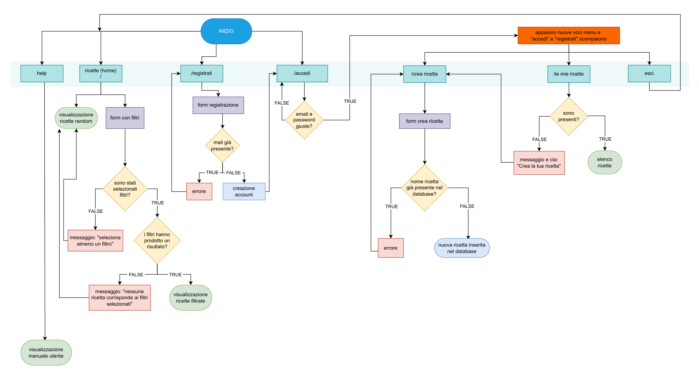

# MANUALE DI MANUTENZIONE - SVUOTAFRIGO v2.0

**Indirizzo Applicazione:** [http://localhost/SVUOTAFRIGO](http://localhost/SVUOTAFRIGO)  
**Organizzazione:** 0-Waste  
**Data Generazione:** 22 Gennaio 2026

---

## INDICE REVISIONI DOCUMENTO
| Versione | Data | Descrizione Modifiche | Autore |
| :--- | :--- | :--- | :--- |
| 1.0 | 20/01/2026 | Versione iniziale: documentazione architettura, DB e diagramma flusso. | Team 0-Waste |
| 2.0 | 22/01/2026 | Integrazione indici figure, scopo tecnico e procedure Excel. | Team 0-Waste |

---

## INDICE
1. [Scopo del Documento per Sviluppatori](#scopo-del-documento-per-sviluppatori)
2. [Informazioni Generali](#informazioni-generali)
3. [Architettura Tecnica](#architettura-tecnica)
   - [Stack Tecnologico](#stack-tecnologico)
   - [Pattern Architetturale MVC](#pattern-architetturale-mvc)
   - [Middleware Pipeline](#middleware-pipeline)
   - [Struttura Directory](#struttura-directory)
4. [Database Schema](#database-schema)
   - [Tabella Utenti](#tabella-utenti)
   - [Tabella Ricette](#tabella-ricette)
   - [Tabella Ingredienti](#tabella-ingredienti)
   - [Tabella Ricette_Ingredienti](#tabella-ricette_ingredienti-junction)
5. [Diagramma di Flusso Applicazione](#diagramma-di-flusso-applicazione)
6. [Procedure di Manutenzione](#procedure-di-manutenzione)
   - [Manutenzione Ordinaria](#manutenzione-ordinaria)
   - [Gestione Dati tramite Excel](#manutenzione-dati-tramite-file-excel)
7. [Troubleshooting (Risoluzione Problemi)](#troubleshooting)
8. [Procedure di Backup e Restore](#procedure-di-backup-e-restore)
9. [Sicurezza e Hardening](#sicurezza-e-hardening)
10. [Monitoraggio e Performance](#monitoraggio-e-performance)
11. [Deployment e Configurazione](#deployment-e-configurazione)
12. [Testing e Quality Assurance](#testing)
13. [Gestione Versioni e Changelog](#gestione-versioni-e-changelog)
14. [Contatti e Supporto](#contatti-e-supporto)
15. [Appendici Tecniche](#appendici)

## INDICE FIGURE
- [Figura 1: Logo Ufficiale SVUOTAFRIGO](#figura-1-logo-ufficiale-svuotafrigo)
- [Figura 2: Schema Architetturale MVC](#figura-2-schema-architetturale-mvc)
- [Figura 3: Diagramma di Flusso Tecnico](#figura-3-diagramma-di-flusso-tecnico)

---

## SCOPO DEL DOCUMENTO PER SVILUPPATORI
Questo manuale è una risorsa tecnica esaustiva destinata esclusivamente al team di sviluppo e ai sistemisti incaricati della manutenzione di SVUOTAFRIGO. 

L'obiettivo è fornire una documentazione di basso livello che permetta di:
*   Mantenere l'operatività del server e l'integrità del database.
*   Eseguire cicli di manutenzione ordinaria (backup, pulizia cache, ottimizzazione SQL).
*   Facilitare il debug di errori server-side e client-side.
*   Documentare l'uso dei **File Excel** per la gestione massiva dei dati alimentari.
*   Garantire che ogni membro del team possa intervenire sull'architettura (Slim/PHP) in modo coerente con gli standard PSR adottati.

Per gli utenti, questo documento garantisce indirettamente la qualità e l'affidabilità del servizio attraverso procedure di controllo standardizzate.

---

## INFORMAZIONI GENERALI
  
*Figura 1: Logo Ufficiale SVUOTAFRIGO - Asset grafico per il branding del sistema.*

**Identificazione Documento:**
*   **Titolo:** Manuale di Manutenzione SVUOTAFRIGO
*   **Versione:** 2.0
*   **Team di Sviluppo:** Andrea, Irene, Kappy, AJ
*   **Azienda:** 0-Waste

**DecisionLog**
  
---

## ARCHITETTURA TECNICA

### Stack Tecnologico
*   **Backend:** PHP 8.x, Slim Framework 4.x, Mustache.php 3.x, PDO.
*   **Frontend:** HTML5, CSS3, Bootstrap 5.x, Vanilla JS (ES6+).
*   **Database:** MySQL 8.x / MariaDB 10.5+.
*   **Server:** Apache 2.4+ (mod_rewrite obbligatorio).

### Pattern Architetturale MVC

*Figura 2: Schema Architetturale MVC - Pipeline di gestione delle richieste server.*

### Middleware Pipeline
L'applicazione processa le richieste attraverso una catena:
`Request → SessionMiddleware → UIMessageMiddleware → FooterMiddleware → MenuMiddleware → PageMiddleware → Controller → Response`.

---

## DATABASE SCHEMA
**Charset:** utf8mb4 | **Collation:** utf8mb4_unicode_ci

#### Tabella: utenti
| Colonna | Tipo | Descrizione |
|---------|------|-------------|
| id_utente | INT (PK) | ID univoco utente |
| email | VARCHAR(100) | Email per login (Unique) |
| password | VARCHAR(255) | Hash password (BCRYPT) |

#### Tabella: ricette
Contiene i metadati della ricetta e i flag booleani per i filtri dietetici (vegetariana, vegana, senza_glutine, ecc.).

#### Tabella: ingredienti
Catalogo degli alimenti con vincolo UNIQUE sul nome.

#### Tabella: ricette_ingredienti (Junction)
Relazione Many-to-Many tra ricette e ingredienti tramite chiavi esterne.

---

## DIAGRAMMA DI FLUSSO APPLICAZIONE
Il diagramma descrive la logica di gestione tra utenti Guest e Authenticated, includendo i bivi per la validazione dei dati e la persistenza.

  
*Figura 3: Diagramma di Flusso Tecnico - Percorso decisionale tra Middleware e Controller.*

---

## PROCEDURE DI MANUTENZIONE

### Manutenzione Ordinaria
1. **Backup Database (Giornaliero)**: Utilizzare `mysqldump`.
2. **Pulizia Cache Template (Settimanale)**: `rm -rf cache/mustache/*`.
3. **Log Monitoring**: Controllare regolarmente `/var/log/apache2/error.log`.

### MANUTENZIONE DATI TRAMITE FILE EXCEL
Per caricare o aggiornare massivamente il catalogo degli ingredienti (operazione critica per l'efficacia dell'algoritmo):
1.  Preparare il file **Excel (.xlsx)** seguendo il template in `assets/templates/import_ingredients.xlsx`.
2.  Utilizzare lo script CLI `php includes/scripts/import_excel.php`.
3.  Lo script esegue il parsing del file Excel, verifica i duplicati e inserisce i nuovi ingredienti nella tabella `ingredienti`.
4.  Questo sistema permette di aggiornare il catalogo stagionale in pochi secondi senza errori di digitazione manuale su SQL.

---

## TROUBLESHOOTING
*   **Problema 1: Database Connection Failed**: Verificare lo stato di MySQL e le credenziali in `Database.php`.
*   **Problema 2: 404 su tutte le rotte**: Verificare che `.htaccess` sia presente e `AllowOverride All` sia attivo in Apache.
*   **Problema 3: Sessione non persiste**: Controllare i permessi di scrittura sulla cartella delle sessioni di PHP.

---

## SICUREZZA E HARDENING
*   **SQL Injection**: Impedito tramite Prepared Statements PDO in ogni query.
*   **XSS**: Gestito tramite l'auto-escape nativo di Mustache.
*   **CSRF Protection**: Da implementare tramite token di sessione nei form POST.

---
*Fine Manuale Manutenzione - Documentazione Riservata 0-Waste © 2026*