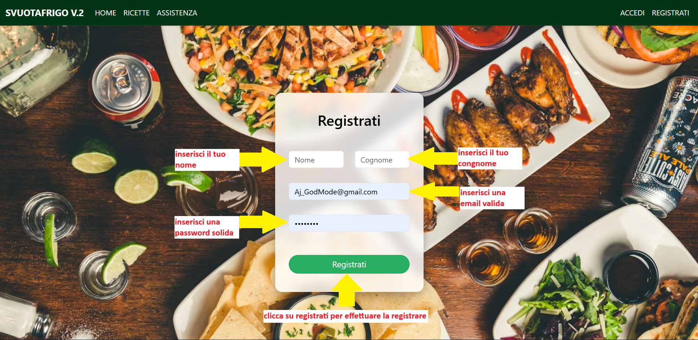

# MANUALE UTENTE - SVUOTAFRIGO v.2

---

## INTRODUZIONE E SCOPO

Il progetto **SVUOTAFRIGO** nasce come risposta concreta al problema dello spreco alimentare domestico, un fenomeno che ogni anno vede tonnellate di cibo finire nella spazzatura nelle sole abitazioni private. Basandosi sulle evidenze scientifiche della tesi di dottorato di Silvia Gaiani (2021), l'applicazione si pone l'obiettivo di "educare" l'utente a guardare la propria dispensa con occhi nuovi.

### Obiettivi Principali

Lo scopo principale è fornire una soluzione tecnologica immediata: l'utente non deve più chiedersi *"cosa cucino stasera?"*, ma *"come posso usare quello che ho?"*. Attraverso un algoritmo di filtraggio avanzato, l'app non solo suggerisce ricette, ma le modella sulle tue necessità mediche, etiche o religiose, garantendo un'esperienza inclusiva e sicura per tutti.

### Benefici Concreti

- **💰 Risparmio economico**: Utilizzando gli ingredienti che hai già, riduci gli acquisti inutili
- **♻️ Sostenibilità ambientale**: Contribuisci attivamente alla riduzione dello spreco alimentare
- **⏱️ Ottimizzazione del tempo**: Ricette veloci pensate per la vita quotidiana
- **🍽️ Alimentazione personalizzata**: Filtri intelligenti per esigenze dietetiche, religiose e mediche

---

## REQUISITI DI SISTEMA

### Accesso
- **Piattaforma**: Web App accessibile da PC, Tablet e Smartphone
- **Browser consigliati**: Chrome, Firefox, Safari, Edge (versioni aggiornate)
- **Risoluzione**: Ottimizzata per tutte le risoluzioni, design responsive

### Connettività
- È necessaria una **connessione internet attiva**
- L'applicazione funziona solo in modalità online

### Account Utente
- La **registrazione è opzionale**
- Funzionalità disponibili senza account:
  - Ricerca ricette con filtri
  - Visualizzazione ricette pubbliche
  - Accesso alle FAQ e assistenza
- Funzionalità disponibili solo con account:
  - Creazione di ricette personali
  - Salvataggio e gestione delle proprie ricette
  - Personalizzazione del profilo

---

## GUIDA RAPIDA

Segui questi semplici passaggi per iniziare a utilizzare SVUOTAFRIGO:

1. **Accedi al sito**: Apri il browser e vai all'indirizzo dell'applicazione
2. **Esplora la Home**: Scopri i benefici e le funzionalità dell'app nella pagina iniziale
3. **Vai su Ricette**: Clicca su "Ricette" nel menu o sul pulsante "Inizia ora"
4. **Inserisci gli ingredienti**: Scrivi gli ingredienti che hai in frigo/dispensa e clicca "Aggiungi"
5. **Applica i filtri** (opzionale): Seleziona portata, stile di vita o intolleranze
6. **Cerca**: Clicca su "Scopri cosa puoi cucinare"
7. **Visualizza risultati**: Sfoglia le ricette suggerite e scegli quella che preferisci

**Per funzionalità avanzate**:
- **Registrati**: Clicca su "Registrati" nel menu per creare un account
- **Crea ricette**: Una volta loggato, usa "Crea Ricetta" per aggiungere le tue ricette

---

## USO DETTAGLIATO

### 1. Navigazione - Utente Ospite (Senza Login)

Al primo accesso, il menu di navigazione presenta le seguenti voci:

#### **SVUOTAFRIGO v.2** (Brand/Logo)
Cliccando sul brand torni sempre alla pagina principale (Ricette).

#### **Home** 
Pagina di benvenuto con:
- **Hero section**: Presentazione dell'app con slogan "Cucina senza sprechi 🍝"
- **Call to action**: Pulsante "Inizia ora" che porta alla pagina Ricette
- **Sezione benefici**: Tre card che illustrano i vantaggi principali:
  - 💰 Meno spesa - Usa ciò che hai già in frigo
  - ♻️ Zero sprechi - Dai nuova vita agli ingredienti dimenticati
  - ⏱️ Più tempo per te - Ricette rapide per tutti i giorni

#### **Ricette**
Pagina principale dell'applicazione. Contiene:
- Form per l'inserimento degli ingredienti
- Sistema di filtri intelligenti (Portata, Stile di Vita, Intolleranze)
- Visualizzazione dei risultati di ricerca
- Dettagli completi delle ricette (ingredienti, procedimento, caratteristiche)

#### **Assistenza**
Pagina di supporto con:
- **FAQ (Domande Frequenti)**: Accordion con 6 domande e risposte comuni
- **Form contatti**: Per inviare richieste di supporto via email
  - Risposta garantita entro 24 ore
- **Download manuale**: Link per scaricare questo manuale in formato PDF

#### **Accedi**
Form di login per utenti già registrati:
- Campo email
- Campo password
- Pulsante per effettuare l'accesso

#### **Registrati**
Form di registrazione per nuovi utenti:
- Campo nome
- Campo email
- Campo password
- Pulsante per creare l'account

---

### 2. Navigazione - Utente Registrato

Dopo aver effettuato il login, il menu si trasforma per offrire strumenti avanzati:

#### **Ciao [Nome Utente]** (Brand/Logo)
Il brand mostra ora un saluto personalizzato con il nome dell'utente registrato.

#### **Home**
Stessa pagina degli ospiti, con contenuto informativo sui benefici dell'app.

#### **Ricette**
Stessa funzionalità degli ospiti, ma con accesso alle ricette create da te oltre a quelle pubbliche.

#### **Assistenza**
Stessa funzionalità degli ospiti, per FAQ e supporto tecnico.

#### **Crea Ricetta**
Nuova voce del menu disponibile solo per utenti registrati. Permette di:
- Inserire una nuova ricetta personale
- Specificare ingredienti, portata, dieta e intolleranze
- Salvare la ricetta nel database personale

#### **Le Mie Ricette**
Area personale dove visualizzi tutte le ricette che hai creato.
- **Comportamento speciale**: Se non hai ancora creato nessuna ricetta, cliccando su questa voce verrai automaticamente reindirizzato alla pagina "Crea Ricetta" per iniziare subito a contribuire.

#### **Esci**
Pulsante per effettuare il logout e tornare alla modalità ospite.

---

### 3. Pagina RICETTE - Sistema di Ricerca

La pagina Ricette è il cuore dell'applicazione. Ecco come funziona nel dettaglio:

#### **Inserimento Ingredienti**

Il sistema di inserimento ingredienti è dinamico e intuitivo:

1. **Campo di input**: Scrivi il nome di un ingrediente (es. "Zucchine, Farina, Uova...")
2. **Pulsante Aggiungi**: Clicca sul pulsante "➕ Aggiungi" 
3. **Badge dinamici**: Gli ingredienti confermati appaiono come badge colorati sotto il campo di input
4. **Rimozione**: Puoi rimuovere ingredienti cliccando sulla X nel badge
5. **Ingredienti multipli**: Aggiungi tutti gli ingredienti che vuoi, uno alla volta

**Suggerimento**: Non è necessario inserire tutti gli ingredienti della ricetta. L'algoritmo trova ricette che usano gli ingredienti che hai, anche se ne richiedono altri.

#### **Filtri Intelligenti**

I filtri sono organizzati in tre categorie principali:

**🍽️ PORTATA**
- Antipasto
- Primo
- Secondo
- Contorno
- Dolce

**🌱 STILE DI VITA**
- Vegetariana (senza carne/pesce)
- Vegana (senza ingredienti di origine animale)
- Halal (conforme alla dieta musulmana)
- Kosher (conforme alla dieta ebraica)

**⚠️ INTOLLERANZE**
- Senza Glutine
- Senza Lattosio
- Senza Crostacei
- Senza Frutta Secca

**Come usare i filtri**:
- Puoi selezionare uno o più filtri contemporaneamente
- I filtri si sommano: selezionando "Primo" + "Vegana" otterrai solo primi piatti vegani
- I filtri sono opzionali: puoi cercare solo per ingredienti senza applicare filtri

#### **Ricerca e Risultati**

1. Dopo aver inserito ingredienti e/o filtri, clicca su **"🔍 Scopri cosa puoi cucinare"**
2. L'app mostrerà una griglia di ricette compatibili
3. Ogni ricetta mostra:
   - Titolo
   - Ingredienti necessari
   - Procedimento
   - Badge per portata, dieta e allergie

---

### 4. Pagina CREA RICETTA (Solo Utenti Registrati)

Questa pagina permette di aggiungere le tue ricette personali al database:

#### **Inserimento Ingredienti**
Sistema identico alla pagina Ricette: campo di input + pulsante Aggiungi + badge dinamici.

#### **Selezione Portata**
Checkbox per selezionare una o più categorie:
- Antipasto
- Primo
- Secondo
- Contorno
- Dolce

#### **Selezione Stile di Vita**
Checkbox per indicare a quale dieta è adatta la ricetta:
- Vegetariana
- Vegana
- Halal (Dieta Musulmana)
- Kosher (Dieta Ebraica)

#### **Selezione Intolleranze**
Checkbox per indicare se la ricetta è sicura per chi ha intolleranze:
- Senza Glutine
- Senza Lattosio
- Senza Crostacei
- Senza Frutta Secca

**Nota**: Di default, le ricette sono considerate "Senza Crostacei" e "Senza Frutta Secca" (valori predefiniti nel database).

#### **Titolo della Ricetta**
Campo di testo obbligatorio per il nome della ricetta (es. "Pasta al Pomodoro").

#### **Procedimento**
Campo di testo multi-riga obbligatorio dove descrivere i passaggi della preparazione.

#### **Invio**
Pulsante **"Inserisci la tua ricetta"** per salvare la ricetta nel database.

**Importante**: Le ricette create sono visibili solo all'utente che le ha create, non sono pubbliche.

---

### 5. Pagina LE MIE RICETTE (Solo Utenti Registrati)

Questa sezione mostra tutte le ricette che hai creato personalmente.

**Funzionalità**:
- Visualizzazione delle tue ricette in formato griglia
- Ogni ricetta mostra titolo, ingredienti e procedimento
- Possibilità di consultare le tue ricette salvate

**Redirect automatico**: 
Se non hai ancora creato nessuna ricetta, verrai automaticamente reindirizzato alla pagina "Crea Ricetta" per iniziare subito a inserire la tua prima ricetta.

**Cancellazione ricetta creata da parte dell'utente**:
Quando un utente crea la ricetta ha sempre la possibilità di eliminarla.
---

### 6. Pagina ASSISTENZA

Questa pagina offre supporto completo agli utenti:

#### **FAQ (Domande Frequenti)**
Sezione con accordion espandibili che rispondono alle domande più comuni:

1. **Cos'è l'app Svuotafrigo?**
   - Spiegazione dello scopo e dei benefici dell'app

2. **Come funziona l'app?**
   - Guida step-by-step: inserire ingredienti, applicare filtri, ricevere suggerimenti

3. **Devo inserire tutti gli ingredienti esatti?**
   - Chiarimento sull'algoritmo di matching parziale

4. **Le ricette sono adatte a tutti?**
   - Spiegazione dei filtri per portata, stile di vita e intolleranze

5. **In che modo l'app aiuta a ridurre lo spreco alimentare?**
   - Benefici ambientali e pratici dell'utilizzo dell'app

6. **Posso usare l'app anche se ho pochi ingredienti?**
   - Conferma che bastano 2-3 ingredienti per trovare ricette

#### **Form Contatti**
Sezione per richiedere assistenza tecnica:
- **Campo Email**: Per la risposta del team
- **Campo Messaggio**: Per descrivere il problema o la richiesta
- **Pulsante Invio**: Invia la richiesta al team
- **Tempo di risposta**: Massimo 24 ore lavorative

#### **Download Manuale**
Pulsante per scaricare questo manuale in formato PDF per consultazione offline.

---

### 7. Gestione Account

#### **Registrazione**
Per creare un nuovo account:
1. Clicca su **"Registrati"** nel menu
2. Compila il form con:
   - Nome (sarà mostrato nel menu dopo il login)
   - Email (deve essere unica, non già registrata)
   - Password
3. Clicca sul pulsante di registrazione
4. Se la registrazione va a buon fine, verrai reindirizzato alla pagina di login

#### **Accesso (Login)**
Per accedere con un account esistente:
1. Clicca su **"Accedi"** nel menu
2. Inserisci email e password
3. Clicca sul pulsante di accesso
4. Se le credenziali sono corrette, verrai loggato e il menu si aggiornerà

#### **Logout (Esci)**
Per uscire dal tuo account:
1. Clicca su **"Esci"** nel menu (visibile solo quando sei loggato)
2. La sessione verrà terminata e tornerai alla modalità ospite

---

## I FILTRI INTELLIGENTI - Guida Dettagliata

### Tipologia di Portata

Seleziona il tipo di piatto che vuoi preparare:

- **Antipasto**: Piatti da servire all'inizio del pasto (es. bruschette, hummus)
- **Primo**: Pasta, riso, zuppe, piatti principali a base di carboidrati
- **Secondo**: Piatti proteici, carne, pesce, uova (o alternative vegetali)
- **Contorno**: Verdure e accompagnamenti
- **Dolce**: Dessert e dolci di ogni tipo

**Esempio pratico**: Se hai ospiti a cena e hai già deciso l'antipasto, puoi filtrare per "Primo" per scoprire cosa cucinare come portata successiva.

### Stile di Vita / Etica / Religione

Filtra le ricette in base a scelte etiche, religiose o di stile di vita:

- **Vegetariana**: Ricette senza carne e pesce, ma che possono contenere uova, latticini, miele
- **Vegana**: Ricette completamente prive di ingredienti di origine animale
- **Halal (Musulmana)**: Ricette conformi ai precetti alimentari islamici
- **Kosher (Ebraica)**: Ricette conformi alla kasherut ebraica

**Esempio pratico**: Se inviti amici vegani, seleziona il filtro "Vegana" per essere sicuro che la ricetta sia adatta a loro.

### Intolleranze / Allergie / Salute

Filtra le ricette per escludere allergeni specifici:

- **Senza Glutine**: Per celiaci o intolleranti al glutine
- **Senza Lattosio**: Per intolleranti al lattosio
- **Senza Crostacei**: Per allergici a crostacei e molluschi
- **Senza Frutta Secca**: Per allergici a noci, mandorle, nocciole, ecc.

**Esempio pratico**: Se sei celiaco, seleziona sempre "Senza Glutine" per vedere solo ricette sicure per te.

### Combinazione di Filtri

I filtri possono essere combinati per ricerche molto specifiche:

**Esempi di combinazioni**:
- "Primo" + "Vegana" + "Senza Glutine" = Primi piatti vegani e gluten-free
- "Dolce" + "Senza Lattosio" = Dolci senza lattosio
- "Secondo" + "Vegetariana" = Secondi piatti vegetariani

**Attenzione**: Più filtri applichi, più ristretti saranno i risultati. Se non trovi ricette, prova a rimuovere qualche filtro.

---

## ALGORITMO DI RICERCA - Come Funziona

### Matching degli Ingredienti

L'algoritmo di SVUOTAFRIGO utilizza un sistema di matching intelligente:

1. **Ingredienti inseriti**: L'app memorizza tutti gli ingredienti che hai aggiunto
2. **Ricerca nel database**: Cerca ricette che contengono quegli ingredienti
3. **Matching parziale**: Non è necessario avere TUTTI gli ingredienti
   - Se una ricetta richiede 5 ingredienti e tu ne hai 3, la ricetta verrà comunque mostrata
   - Le ricette con più ingredienti in comune appaiono più rilevanti
4. **Filtri aggiuntivi**: I filtri selezionati restringono ulteriormente i risultati

**Vantaggio**: Anche con pochi ingredienti in frigo, puoi trovare ricette utili. Potrai poi decidere se acquistare gli ingredienti mancanti o cercare alternative.

---

## TROUBLESHOOTING (Risoluzione Problemi)

### Problemi di Navigazione

#### **Problema**: Non vedo la voce "Crea Ricetta" nel menu
- **Causa**: Sei in modalità Ospite (non loggato)
- **Soluzione**: Effettua il login o registrati per vedere questa opzione

#### **Problema**: Ho cliccato "Le mie Ricette" ma mi ha portato su "Crea Ricetta"
- **Causa**: Non hai ancora salvato nessuna ricetta
- **Soluzione**: È il comportamento corretto. Il sistema ti invita a inserire la tua prima ricetta

#### **Problema**: Il menu mostra "SVUOTAFRIGO v.2" invece del mio nome
- **Causa**: Non hai effettuato il login o la sessione è scaduta
- **Soluzione**: Effettua nuovamente il login dalla pagina "Accedi"

### Problemi di Ricerca

#### **Problema**: I filtri non danno risultati
- **Causa**: Combinazione di filtri troppo specifica o ingredienti non compatibili
- **Soluzione**: 
  - Prova a deselezionare alcuni filtri
  - Rimuovi alcuni ingredienti
  - Cerca con meno parametri

#### **Problema**: Non trovo ricette con i miei ingredienti
- **Causa**: Gli ingredienti inseriti potrebbero non essere nel database
- **Soluzione**:
  - Verifica l'ortografia degli ingredienti
  - Prova con ingredienti più comuni
  - Crea tu stesso una ricetta con quegli ingredienti (se sei registrato)

#### **Problema**: Le ricette mostrate richiedono ingredienti che non ho
- **Causa**: L'algoritmo mostra anche ricette con matching parziale
- **Soluzione**: È normale. Valuta se:
  - Acquistare gli ingredienti mancanti (spesso sono pochi)
  - Sostituire ingredienti con alternative che hai già
  - Cercare altre ricette scorrendo i risultati

### Problemi di Inserimento Ingredienti

#### **Problema**: Il pulsante "Aggiungi" non funziona
- **Causa**: Campo ingrediente vuoto o errore JavaScript
- **Soluzione**:
  - Assicurati di aver scritto qualcosa nel campo
  - Ricarica la pagina (F5)
  - Prova con un altro browser

#### **Problema**: Non riesco a rimuovere un ingrediente aggiunto
- **Causa**: Badge non cliccabile o errore JavaScript
- **Soluzione**: Ricarica la pagina e reinserisci gli ingredienti corretti

### Problemi di Account

#### **Problema**: Non riesco a registrarmi
- **Causa possibili**:
  - Email già registrata
  - Password troppo debole
  - Campi obbligatori non compilati
- **Soluzione**:
  - Verifica che l'email non sia già in uso
  - Usa una password più complessa
  - Compila tutti i campi richiesti

#### **Problema**: Non riesco ad accedere
- **Causa possibili**:
  - Email o password errate
  - Account non esistente
- **Soluzione**:
  - Verifica le credenziali (attenzione a maiuscole/minuscole)
  - Se hai dimenticato la password, contatta l'assistenza
  - Verifica di aver completato la registrazione

#### **Problema**: La sessione si disconnette spesso
- **Causa**: Timeout della sessione server
- **Soluzione**: Effettua nuovamente il login. È un comportamento di sicurezza normale

### Problemi di Creazione Ricetta

#### **Problema**: Non riesco a salvare la ricetta
- **Causa possibili**:
  - Campi obbligatori non compilati (titolo, procedimento)
  - Nessun ingrediente inserito
  - Errore di connessione
- **Soluzione**:
  - Verifica di aver compilato Titolo e Procedimento
  - Aggiungi almeno un ingrediente
  - Controlla la connessione internet

#### **Problema**: Non vedo la ricetta appena creata
- **Causa**: Potresti non essere nella pagina "Le Mie Ricette"
- **Soluzione**: Vai su "Le Mie Ricette" dal menu per visualizzare tutte le tue ricette

### Problemi Tecnici

#### **Problema**: Il sito carica lentamente
- **Causa**: Connessione internet lenta o problemi server
- **Soluzione**:
  - Verifica la tua connessione internet
  - Prova a ricaricare la pagina
  - Attendi qualche minuto e riprova

#### **Problema**: Alcuni stili grafici non si caricano
- **Causa**: CSS non caricato o cache browser
- **Soluzione**:
  - Ricarica la pagina con CTRL+F5 (refresh forzato)
  - Svuota la cache del browser
  - Prova con un browser diverso

#### **Problema**: Il form di contatto non invia il messaggio
- **Causa**: Campi non compilati o errore server
- **Soluzione**:
  - Verifica di aver inserito email e messaggio
  - Controlla la connessione internet
  - Se il problema persiste, invia un'email direttamente al supporto

### Problemi di Visualizzazione

#### **Problema**: Il layout si vede male su mobile
- **Causa**: Browser non aggiornato
- **Soluzione**: Aggiorna il browser alla versione più recente

#### **Problema**: Le ricette non si visualizzano nella griglia
- **Causa**: JavaScript disabilitato o errore di caricamento
- **Soluzione**:
  - Abilita JavaScript nel browser
  - Ricarica la pagina
  - Prova con un browser diverso

---

## ASSISTENZA E SUPPORTO

### Canali di Supporto

#### **Form Contatti**
Il modo principale per richiedere assistenza:
- Accessibile dalla pagina "Assistenza"
- Compila email e messaggio
- **Tempo di risposta**: Entro 24 ore lavorative (dal lunedì al venerdì)

#### **FAQ (Domande Frequenti)**
Prima di contattare il supporto, consulta la sezione FAQ nella pagina Assistenza. Molte domande comuni trovano già risposta lì.

#### **Manuale Utente**
Questo documento contiene tutte le informazioni dettagliate sull'uso dell'applicazione. È disponibile:
- Online (questa pagina)
- In formato PDF (scaricabile dalla pagina Assistenza)

### Cosa Includere nella Richiesta di Supporto

Per una risposta più rapida ed efficace, includi nel tuo messaggio:
- **Descrizione del problema**: Spiega cosa non funziona o cosa ti aspettavi
- **Passaggi per riprodurre**: Cosa hai fatto prima che si verificasse il problema
- **Browser usato**: Nome e versione (es. Chrome 120, Firefox 115)
- **Dispositivo**: PC, tablet o smartphone
- **Screenshot** (se possibile): Invia screenshot dell'errore via email

---

## PRIVACY E DATI PERSONALI

### Dati Raccolti

SVUOTAFRIGO raccoglie solo i dati essenziali per il funzionamento:

**Per utenti ospiti**:
- Nessun dato personale memorizzato
- Gli ingredienti e filtri inseriti sono temporanei (solo per la sessione)

**Per utenti registrati**:
- Nome utente
- Email
- Password (criptata nel database)
- Ricette create dall'utente

### Utilizzo dei Dati

I dati personali sono utilizzati esclusivamente per:
- Fornire l'accesso personalizzato all'account
- Salvare e gestire le ricette create
- Rispondere a richieste di supporto

**Non condividiamo i tuoi dati con terze parti.**

### Sicurezza

- Le password sono salvate in formato criptato nel database
- La connessione utilizza protocolli sicuri
- L'accesso ai dati è limitato agli amministratori autorizzati

---

## GLOSSARIO DEI TERMINI

**Account**: Profilo utente registrato che permette di accedere a funzionalità avanzate

**Algoritmo di matching**: Sistema che confronta gli ingredienti inseriti con le ricette nel database

**Badge**: Etichetta colorata che mostra gli ingredienti confermati o le caratteristiche delle ricette

**Database**: Archivio digitale dove sono salvate tutte le ricette e gli utenti

**FAQ**: Frequently Asked Questions, domande frequenti

**Filtri**: Opzioni di ricerca per restringere i risultati (portata, dieta, intolleranze)

**Halal**: Conforme ai precetti alimentari islamici

**Kosher**: Conforme alle regole alimentari ebraiche (kasherut)

**Login**: Accesso all'account con email e password

**Logout**: Uscita dall'account

**Matching parziale**: Ricette che contengono solo alcuni degli ingredienti inseriti

**Ospite**: Utente non registrato che usa l'app senza account

**Sessione**: Periodo di tempo in cui sei loggato nell'app

**Utente registrato**: Utente che ha creato un account

**Vegano**: Alimentazione priva di qualsiasi ingrediente di origine animale

**Vegetariano**: Alimentazione senza carne e pesce (ma con uova/latticini)

---

## DOMANDE FREQUENTI AGGIUNTIVE

### Funzionalità Generali

**Q: SVUOTAFRIGO è gratuito?**  
R: Sì, l'applicazione è completamente gratuita per tutti gli utenti.

**Q: Devo installare qualcosa?**  
R: No, è una web app che funziona direttamente dal browser. Non serve installare nulla.

**Q: Funziona offline?**  
R: No, è necessaria una connessione internet attiva per utilizzare l'app.

**Q: Posso usare SVUOTAFRIGO su smartphone?**  
R: Sì, il design è responsive e ottimizzato per tutti i dispositivi.

### Ricette

**Q: Quante ricette ci sono nel database?**  
R: Il database contiene ricette pubbliche più tutte le ricette create dagli utenti registrati.

**Q: Posso modificare una ricetta che ho creato?**  
R: Attualmente la funzionalità di modifica non è disponibile. Puoi creare una nuova ricetta corretta.

**Q: Posso eliminare una ricetta che ho creato?**  
R: Al momento la funzionalità di eliminazione non è disponibile tramite interfaccia. Contatta il supporto se necessario.

**Q: Le mie ricette sono pubbliche?**  
R: No, le ricette che crei sono visibili solo a te nel tuo account personale.

**Q: Posso condividere una ricetta con altri utenti?**  
R: Attualmente non è disponibile la funzionalità di condivisione diretta.

### Ingredienti

**Q: Cosa succede se scrivo male un ingrediente?**  
R: Se l'ingrediente non corrisponde a nessuno nel database, potresti non trovare risultati. Verifica l'ortografia.

**Q: Posso inserire quantità (es. "200g di farina")?**  
R: No, inserisci solo il nome dell'ingrediente (es. "farina"). Le quantità non vengono considerate dall'algoritmo.

**Q: Quanti ingredienti posso inserire?**  
R: Non c'è un limite specifico, ma si consiglia di inserire 3-8 ingredienti principali per risultati ottimali.

---

## SUGGERIMENTI E BEST PRACTICES

### Per Utenti Ospiti
- Esplora l'app senza registrarti per capire se ti piace
- Usa i filtri per scoprire ricette adatte alle tue esigenze
- Registrati solo se vuoi salvare le tue ricette personali

### Per Utenti Registrati
- Crea ricette dettagliate con procedimenti chiari
- Usa tutti i filtri disponibili per categorizzare correttamente le tue ricette
- Controlla la sezione "Le Mie Ricette" per tenere traccia delle tue creazioni

### Per la Ricerca Efficace
- Inizia con pochi ingredienti principali (3-5)
- Aggiungi filtri solo se necessario
- Se non trovi risultati, rimuovi filtri o ingredienti
- Sperimenta con combinazioni diverse

### Per Ridurre lo Spreco
- Controlla il frigo prima di fare la spesa
- Usa SVUOTAFRIGO per cucinare ingredienti vicini alla scadenza
- Pianifica i pasti settimanali in base a ciò che hai già

---

## CONCLUSIONI

SVUOTAFRIGO è uno strumento semplice ma potente per:
- ✅ Ridurre lo spreco alimentare domestico
- ✅ Risparmiare denaro usando ciò che hai già
- ✅ Scoprire nuove ricette adatte alle tue esigenze
- ✅ Contribuire alla sostenibilità ambientale

**Inizia ora**: Vai alla pagina Ricette e scopri cosa puoi cucinare oggi!

---

**Versione**: 2.0  
**Ultimo aggiornamento**: Gennaio 2026  
**Contatti**: Usa il form nella pagina Assistenza per qualsiasi domanda

---

*Questo manuale è soggetto a modifiche in base agli aggiornamenti dell'applicazione.*
