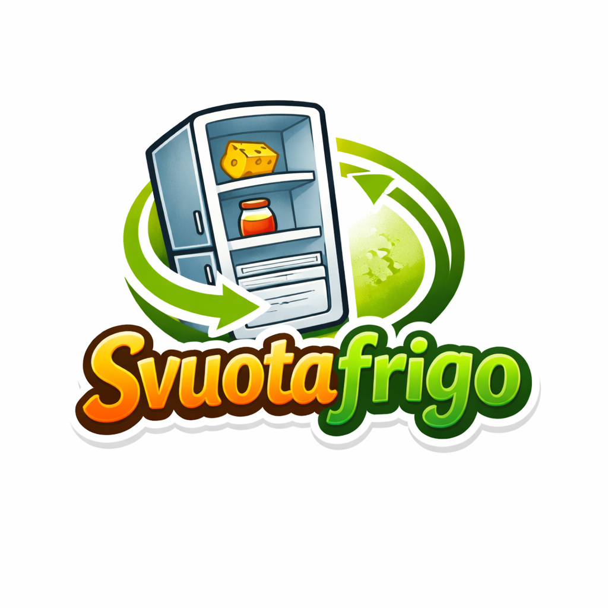
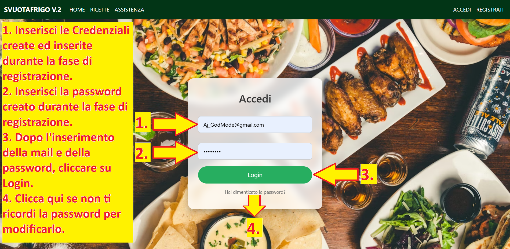
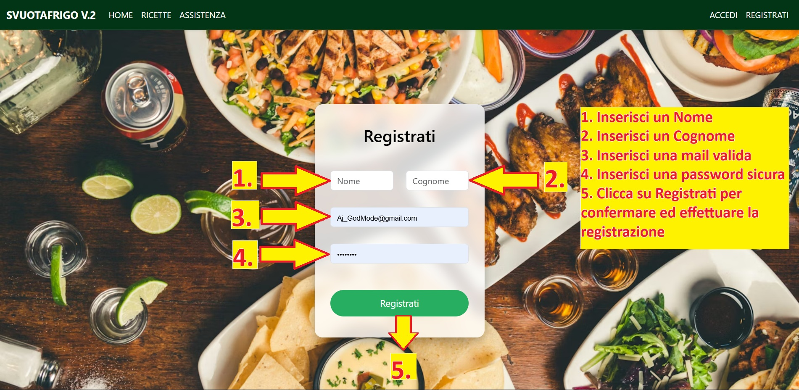
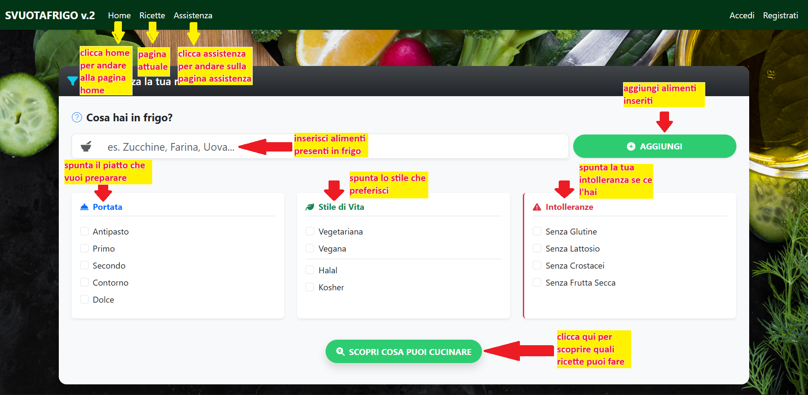

# MANUALE UTENTE - SVUOTAFRIGO v.2

**Indirizzo Web App:** [http://localhost/SVUOTAFRIGO](http://localhost/SVUOTAFRIGO)  
**Organizzazione:** 0-Waste  
**Slogan:** Cucina senza sprechi 🍝

---

## INDICE REVISIONI DOCUMENTO
| Versione | Data | Descrizione Modifiche | Autore |
| :--- | :--- | :--- | :--- |
| 1.0 | 18/01/2026 | Prima stesura completa del manuale d'uso. | Team 0-Waste |
| 2.0 | 22/01/2026 | Integrazione indici figure, scopi differenziati e riferimenti Excel. | Team 0-Waste |

---

## INDICE
1. [Scopo del Documento](#scopo-del-documento)
2. [Introduzione e Scopo del Progetto](#introduzione-e-scopo)
3. [Requisiti di Sistema](#requisiti-di-sistema)
4. [Guida Rapida all'Uso](#guida-rapida)
5. [Uso Dettagliato della Piattaforma](#uso-dettagliato)
   - [Navigazione Utente Ospite](#1-navigazione---utente-ospite-senza-login)
   - [Navigazione Utente Registrato](#2-navigazione---utente-registrato)
   - [Sistema di Ricerca Ricette](#3-pagina-ricette---sistema-di-ricerca)
   - [Creazione Nuove Ricette](#4-pagina-crea-ricetta-solo-utenti-registrati)
   - [Archivio Personale](#5-pagina-le-mie-ricette-solo-utenti-registrati)
6. [Filtri Intelligenti](#i-filtri-intelligenti---guida-dettagliata)
7. [Algoritmo di Ricerca e Matching](#algoritmo-di-ricerca---come-funziona)
8. [Strumenti Excel e Ingredienti](#file-di-excel-e-ingredienti)
9. [Troubleshooting (Risoluzione Problemi)](#troubleshooting-risoluzione-problemi)
10. [Assistenza e Supporto](#assistenza-e-supporto)
11. [Privacy e Dati Personali](#privacy-e-dati-personali)
12. [Glossario dei Termini](#glossario-dei-termini)
13. [Domande Frequenti (FAQ)](#domande-frequenti-aggiuntive)

## INDICE FIGURE
- [Figura 1: Logo Ufficiale SVUOTAFRIGO](#figura-1-logo-ufficiale-svuotafrigo)
- [Figura 2: Interfaccia di Login](#figura-2-interfaccia-di-login)
- [Figura 3: Interfaccia di Registrazione](#figura-3-interfaccia-di-registrazione)
- [Figura 4: Dashboard Ricette e Filtri](#figura-4-dashboard-ricette-e-filtri)

---

## SCOPO DEL DOCUMENTO
Il presente manuale è stato redatto per fornire una guida esaustiva all'utilizzo di SVUOTAFRIGO.

*   **Per l'Utente:** Questa guida spiega come trasformare gli avanzi della dispensa in pasti gustosi, come navigare tra i filtri per la propria salute e come gestire il proprio ricettario personale.
*   **Per lo Sviluppatore:** Il documento serve come specifica per la User Experience (UX). Aiuta il team tecnico a comprendere come l'utente finale percepisce le funzionalità, garantendo che le evoluzioni del codice non compromettano la semplicità d'uso descritta in queste pagine.

---

## INTRODUZIONE E SCOPO
Il progetto **SVUOTAFRIGO** nasce come risposta concreta al problema dello spreco alimentare domestico. L'applicazione si pone l'obiettivo di "educare" l'utente a guardare la propria dispensa con occhi nuovi, riducendo gli sprechi e ottimizzando la spesa.

  
*Figura 1: Logo Ufficiale SVUOTAFRIGO - Il tuo assistente intelligente contro lo spreco.*

---

## GUIDA RAPIDA
1. **Accedi**: Vai su [http://localhost/SVUOTAFRIGO](http://localhost/SVUOTAFRIGO).
2. **Vai su Ricette**: Clicca la voce dedicata nel menu.
3. **Inserisci**: Scrivi gli ingredienti che hai (es. "Pomodoro") e clicca "Aggiungi".
4. **Filtra**: Seleziona se desideri un "Primo" o un piatto "Vegano".
5. **Cerca**: Clicca su "Scopri cosa puoi cucinare".

---

## USO DETTAGLIATO

### Gestione Account
Per salvare le tue creazioni, effettua l'accesso o registrati.

  
*Figura 2: Interfaccia di Login - Accesso per gestire il ricettario personale.*

  
*Figura 3: Interfaccia di Registrazione - Pannello per la creazione di un nuovo profilo.*

### Pagina Ricette
Il cuore del sistema: inserisci gli ingredienti e guarda i badge dinamici apparire sotto il campo di input.

  
*Figura 4: Dashboard Ricette e Filtri - Pannello principale di inserimento e selezione.*

---

## I FILTRI INTELLIGENTI
*   **Portata**: Scegli tra Antipasto, Primo, Secondo, Contorno, Dolce.
*   **Stile di Vita**: Vegetariana, Vegana, Halal, Kosher.
*   **Intolleranze**: Senza Glutine, Senza Lattosio, Senza Crostacei, Senza Frutta Secca.

---

## FILE DI EXCEL E INGREDIENTI
Nella sezione Assistenza, l'utente può scaricare un **File di Excel (.xlsx)** aggiornato. Questo file contiene l'elenco completo di tutti gli ingredienti censiti nel database di SVUOTAFRIGO. 
**Perché consultarlo?** Ti permette di scoprire quali termini esatti l'algoritmo riconosce meglio, aiutandoti a pianificare la spesa o a trovare ispirazione anche quando sei offline.

---

## TROUBLESHOOTING (Risoluzione Problemi)
*   **Il menu non mostra il mio nome**: La sessione potrebbe essere scaduta, effettua nuovamente il login.
*   **Nessuna ricetta trovata**: Prova a rimuovere un filtro (es. togli "Senza Lattosio" se sei sicuro che i tuoi ingredienti siano già sicuri).
*   **Pulsante Aggiungi bloccato**: Assicurati di non aver lasciato il campo di testo vuoto.

---

## PRIVACY E DATI PERSONALI
I tuoi dati sono criptati e non vengono condivisi con terzi. Per gli utenti registrati, è garantito il diritto alla cancellazione totale del profilo e delle relative ricette create.

---
*Fine Manuale Utente - © 2026 0-Waste - Svuota il frigo, riempi il cuore.*